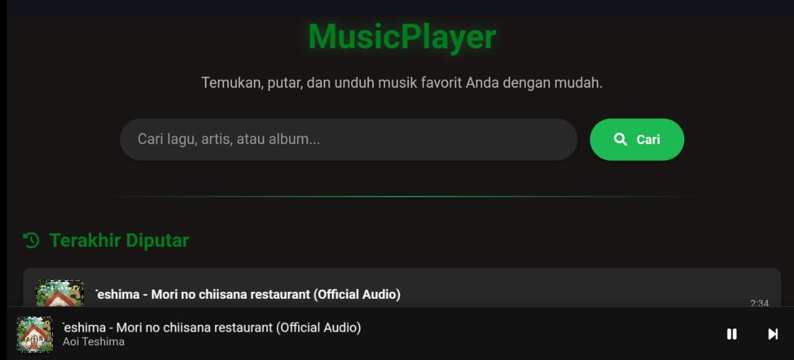

# Music Player Web Application

<p align="center">
  
</p>

## 🎵 Overview

Music Player adalah aplikasi web yang memungkinkan pengguna mencari, memutar, dan mengunduh musik dari YouTube. Dirancang dengan fokus pada pengalaman pengguna yang baik, antarmuka yang responsif, dan fitur-fitur intuitif, Music Player menyediakan cara mudah untuk menikmati musik langsung di browser Anda.

## ✨ Features

- **Pencarian Lagu** - Cari lagu, artis, atau album dari YouTube
- **Pemutaran Langsung** - Putar musik langsung di browser tanpa perlu mengunduh terlebih dahulu
- **Download MP3** - Unduh lagu yang sedang diputar dalam format MP3
- **Riwayat Pemutaran** - Lihat dan akses kembali lagu-lagu yang baru saja diputar
- **Antrian Lagu** - Lihat lagu berikutnya yang akan diputar dalam playlist
- **Kontrol Pemutaran Lengkap**:
  - Play/Pause
  - Lompat ke lagu sebelumnya/berikutnya
  - Mode shuffle untuk pemutaran acak
  - Mode repeat untuk mengulang lagu saat ini
  - Kontrol timeline (lompat ke bagian tertentu dari lagu)
- **Responsive Design** - Tampilan yang optimal di desktop dan perangkat mobile
- **Mini Player & Full Screen Mode** - Pilihan tampilan pemutaran yang fleksibel

## 🚀 Teknologi

Music Player dibangun dengan teknologi web dasar:

- **HTML5** - Struktur dan markup
- **CSS3** - Styling, animasi, dan responsivitas
- **JavaScript** - Logika aplikasi dan interaksi pengguna
- **Font Awesome** - Ikon-ikon UI
- **Siputz API** - API untuk pencarian YouTube dan konversi/download MP3

## 📁 Struktur Project

Project menggunakan struktur modular dengan pemisahan HTML, CSS, dan JavaScript untuk memudahkan pengembangan dan pemeliharaan:

```
music-player/
│
├── css/
│   └── style.css               # Stylesheet utama
├── js/
│   ├── config.js               # Konfigurasi API dan pengaturan
│   └── script.js               # File JavaScript utama
├── index.html                  # File HTML utama
└── README.md                   # Dokumentasi project
```

## 🆕 Perubahan Terbaru

Beberapa perubahan terbaru pada aplikasi:

1. **Pemisahan File** - HTML, CSS, dan JavaScript dipisahkan ke dalam file terpisah untuk kemudahan pengembangan
2. **Konfigurasi API yang Disederhanakan** - Struktur konfigurasi API yang lebih sederhana dan direct
3. **Error Handling yang Lebih Robust** - Penanganan kesalahan yang lebih baik untuk stabilitas aplikasi
4. **Direct Data Access** - Pengambilan data yang lebih sederhana meningkatkan kinerja dan mengurangi error
5. **Animasi dan UI yang Ditingkatkan** - Pengalaman pengguna yang lebih mulus dengan animasi yang lebih baik

## 🔧 Cara Penggunaan

### Instalasi

1. **Clone repositori**
   ```bash
   git clone https://github.com/FlowFalcon/music-player.git
   ```

2. **Buka folder proyek**
   ```bash
   cd music-player
   ```

3. **Jalankan aplikasi**
   - Buka file `index.html` di browser web favorit Anda, atau
   - Gunakan server lokal seperti Live Server extension di VSCode

### Penggunaan

1. **Mencari Lagu**
   - Masukkan judul lagu, nama artis, atau album di kotak pencarian
   - Klik tombol "Cari" atau tekan Enter

2. **Memutar Lagu**
   - Klik pada hasil pencarian untuk memutar lagu
   - Gunakan kontrol di mini player atau full player untuk mengontrol pemutaran

3. **Mengunduh Lagu**
   - Klik tombol "Download MP3" pada full player untuk mengunduh lagu yang sedang diputar

4. **Melihat Riwayat Pemutaran**
   - Riwayat pemutaran ditampilkan di halaman utama
   - Klik pada lagu di riwayat untuk memutarnya kembali

## 🧰 Konfigurasi API

Aplikasi ini menggunakan konfigurasi API yang sederhana dan langsung:

```javascript
// API URLs - Basic configuration
const API_URL = {
    SEARCH: 'https://api.siputzx.my.id/api/s/youtube',
    DOWNLOAD_MP3: 'https://api.siputzx.my.id/api/d/ytmp3'
};

// App defaults
const APP_DEFAULTS = {
    DEFAULT_SEARCH: 'popular songs 2025',
    MAX_RECENT_ITEMS: 10,
    MAX_QUEUE_ITEMS: 5,
    STORAGE_KEY: 'recentlyPlayed'
};
```

## 📱 Responsivitas

Music Player didesain untuk bekerja dengan baik di semua ukuran layar:

- **Desktop**: Tampilan grid dan kontrol lengkap
- **Tablet**: Tata letak yang dioptimalkan untuk layar menengah
- **Mobile**: Antarmuka yang ramping dengan ukuran elemen yang disesuaikan

## ⚡ Tips Pengembangan

Jika Anda ingin mengembangkan aplikasi ini lebih lanjut:

1. **Konfigurasi API**:
   - File `config.js` berisi semua pengaturan API dan nilai default
   - Ubah URL API dan pengaturan default sesuai kebutuhan

2. **Styling**:
   - Semua style ada di file `style.css`
   - Styling terorganisasi berdasarkan komponen untuk kemudahan pengembangan

3. **Logika Aplikasi**:
   - Logika utama berada di `script.js`
   - Fungsi-fungsi dikelompokkan berdasarkan fungsionalitas

4. **Menambahkan Fitur Baru**:
   - Tambahkan event listener baru di function `setupEventListeners()`
   - Tambahkan fungsi-fungsi baru yang terkait dengan fitur tersebut

## 🔍 Penanganan Error

Aplikasi ini menggunakan pendekatan robust untuk menangani error:

```javascript
try {
    // Fetch data from the API
    const response = await fetch(`${API_URL.SEARCH}?query=${encodeURIComponent(query)}`);
    const data = await response.json();
    
    // Check if we have valid results
    if (!data.status || !data.data || data.data.length === 0) {
        noResultsElement.style.display = 'block';
        return;
    }
    
    // Proceed with valid data...
} catch (error) {
    console.error('Error fetching search results:', error);
    loadingElement.style.display = 'none';
    noResultsElement.style.display = 'block';
}
```

## 🙏 Kredit & Atribusi

- **Siputz API** - Untuk menyediakan API yang membuat music player ini mungkin
- **YouTube** - Sebagai sumber konten musik
- **Font Awesome** - Untuk ikon UI
- **FlowFalcon** - Untuk pengembangan website Music Player


## 📞 Kontak

Jika Anda memiliki pertanyaan, silakan hubungi:

- Email: support@flowfalcon.xyz
- GitHub: [@FlowFalcon](https://github.com/FlowFalcon)
- WhatsApp: +62 851-2336-6391

---

Made with ❤️ by FlowFalcon